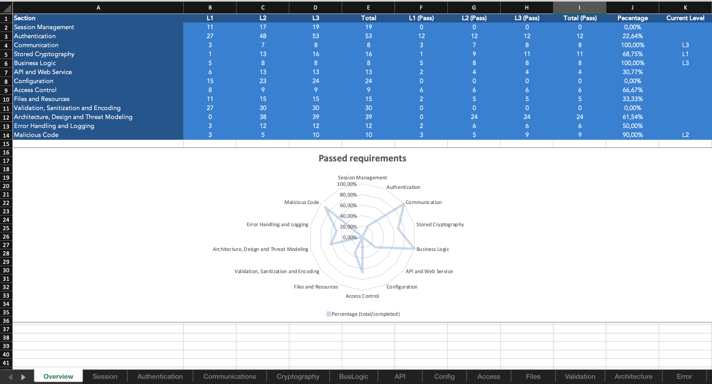
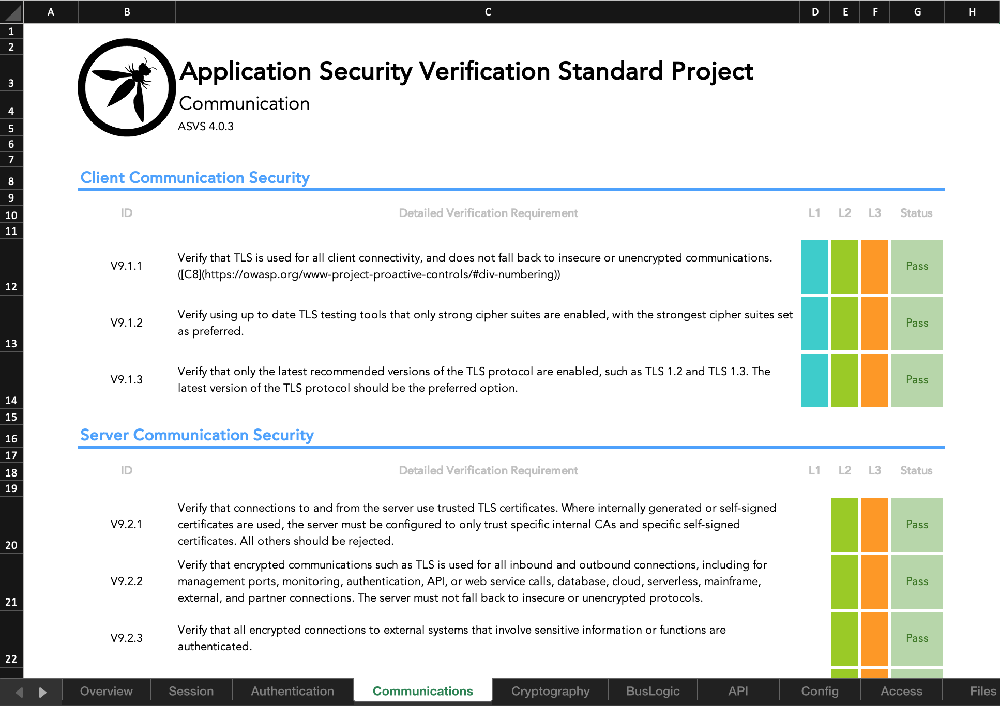

# OWASP Application Security Verification Standard Project (ASVS) Checklist

This is a parallel repository that covers the need to have a checklist for ASVS inspired by the MASVS checklist.

It contains a overview page with details about the progress.

Each section has its own page with all the controls where you can track compliance.

## Usage

The python script takes a json as an input which contains all the controls.

You can obtains these from the official ASVS repository. Usually you can found them in the realeases page.

Once you have a json with the full list of ASVS controls you can generate your own excel file like this:

`python3 main.py -i <asvs-controls>.json`

